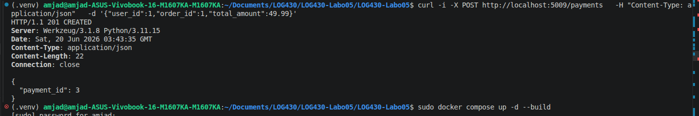
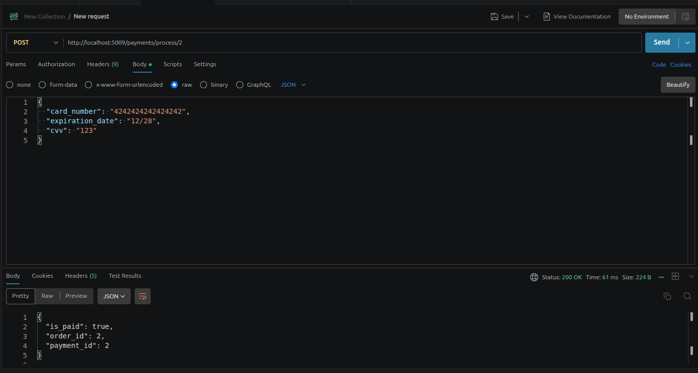
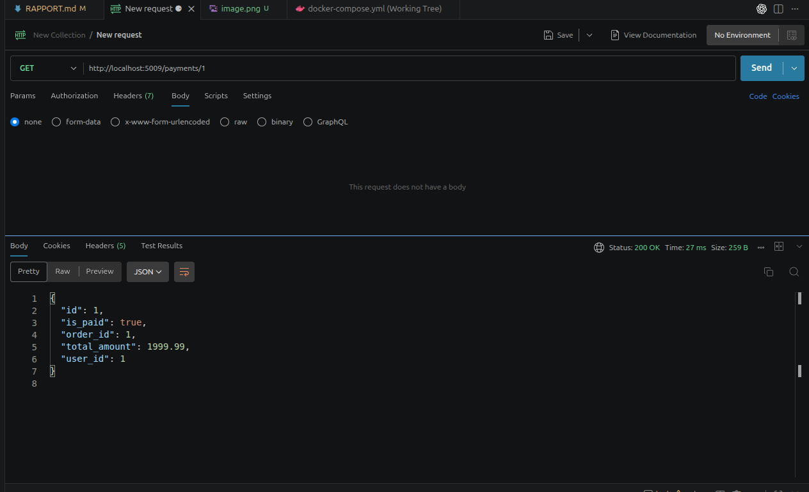
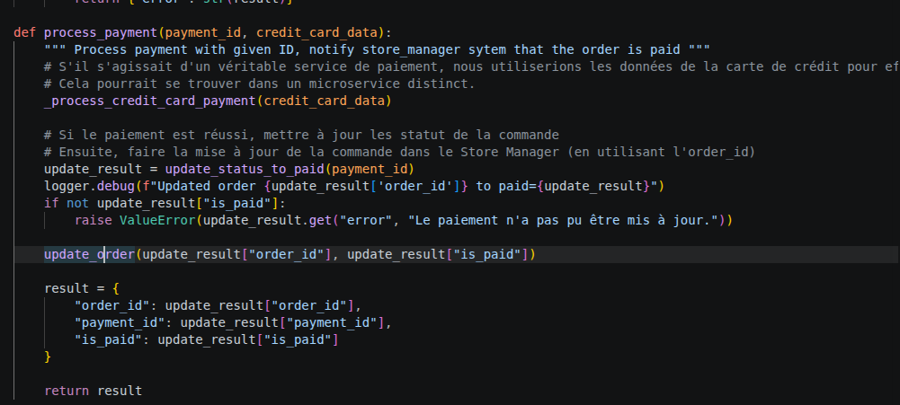
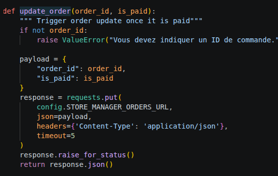
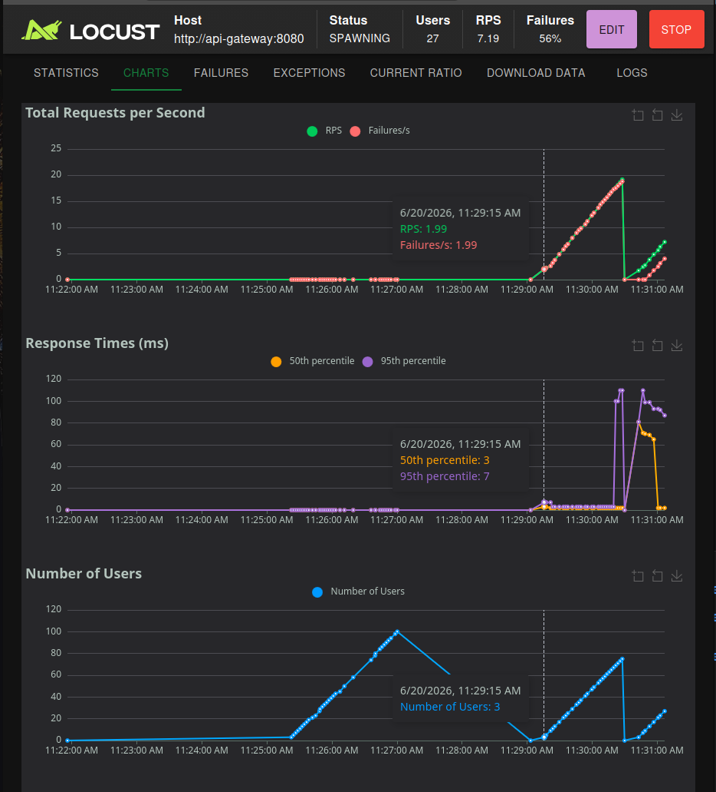

# Questions - Labo 05

## Question 1

Quelle réponse obtenons-nous à la requête à `POST /payments` ? Illustrez votre réponse avec des captures d'écran/du terminal.

### Réponse

La requête `POST /payments` crée une transaction de paiement dans le microservice de paiement. La réponse obtenue est un code HTTP `201 CREATED`, ce qui indique que la ressource a bien été créée. Le corps de la réponse contient l'identifiant du paiement créé, ici `payment_id: 3`.

Cet identifiant pourra ensuite être utilisé pour traiter le paiement avec l'endpoint `POST /payments/process/{payment_id}`.

### Illustration



Sortie terminal :

```bash
curl -i -X POST http://localhost:5009/payments \
  -H "Content-Type: application/json" \
  -d '{"user_id":1,"order_id":1,"total_amount":49.99}'
```

Réponse obtenue :

```http
HTTP/1.1 201 CREATED
Server: Werkzeug/3.1.8 Python/3.11.15
Date: Sat, 20 Jun 2026 03:43:35 GMT
Content-Type: application/json
Content-Length: 22
Connection: close

{
  "payment_id": 3
}
```

---

## Question 2

Quel type d'information envoyons-nous dans la requête à `POST payments/process/:id` ? Est-ce que ce serait le même format si on communiquait avec un service SOA, par exemple ? Illustrez votre réponse avec des exemples et captures d'écran/terminal.

### Réponse

Dans la requête `POST payments/process/:id`, on envoie les informations nécessaires pour simuler le traitement d'un paiement. Il s'agit de données transactionnelles liées au moyen de paiement, par exemple un numéro de carte, une date d'expiration et un code de sécurité. Le `payment_id` est transmis dans l'URL, tandis que les détails du paiement sont transmis dans le corps de la requête au format JSON.

Exemple de corps JSON envoyé :

```json
{
  "card_number": "4242424242424242",
  "expiration_date": "12/28",
  "cvv": "123"
}
```

Dans cette architecture de microservices, l'échange se fait avec une API REST et un corps JSON léger. Si on communiquait avec un service SOA classique, le format serait souvent différent: on utiliserait plutôt SOAP, donc une enveloppe XML plus structurée et plus verbeuse.

Exemple simplifié en SOAP/XML :

```xml
<soap:Envelope>
  <soap:Body>
    <ProcessPayment>
      <paymentId>1</paymentId>
      <cardNumber>4242424242424242</cardNumber>
      <expirationDate>12/28</expirationDate>
      <cvv>123</cvv>
    </ProcessPayment>
  </soap:Body>
</soap:Envelope>
```

### Illustration



La capture Postman de la requête `POST http://localhost:5009/payments/process/2` montre l'onglet `Body` contenant les informations envoyées.

---

## Question 3

Quel résultat obtenons-nous de la requête à `POST payments/process/:id` ?

### Réponse

La requête `POST payments/process/:id` traite le paiement correspondant au `payment_id` fourni dans l'URL. Après cette requête, le paiement est marqué comme réalisé dans le microservice de paiement.

La vérification avec `GET http://localhost:5009/payments/1` retourne un code `200 OK` et montre que le champ `is_paid` vaut `true`. Cela confirme que le paiement a bien été traité.

Résultat observé :

```json
{
  "id": 1,
  "is_paid": true,
  "order_id": 1,
  "total_amount": 1999.99,
  "user_id": 1
}
```

### Illustration



La capture Postman du `GET http://localhost:5009/payments/1` montre le statut `200 OK` et la réponse JSON avec `"is_paid": true`.

---

## Question 4

Quelle méthode avez-vous dû modifier dans `log430-labo05-payment` et qu'avez-vous modifiée ? Justifiez avec un extrait de code.

### Réponse

Dans `log430-labo05-payment`, j'ai dû modifier la méthode `process_payment`. Après avoir traité le paiement avec succès, cette méthode doit maintenant informer le service Store Manager que la commande associée est payée.

Pour faire cela, la méthode récupère le résultat du paiement, puis appelle `update_order` avec l'`order_id` et la valeur de `is_paid`. Cette mise à jour permet de synchroniser l'état de la commande dans `log430-labo05` avec l'état du paiement dans le microservice de paiement.

J'ai aussi ajouté la méthode `update_order`, qui envoie une requête `PUT` vers l'endpoint KrakenD du Store Manager. Le corps JSON contient l'identifiant de la commande et le nouveau statut de paiement.

### Extrait de code

```python
def process_payment(payment_id, credit_card_data):
    """ Process payment with given ID, notify store manager system that the order is paid """
    _process_credit_card_payment(credit_card_data)

    update_result = update_status_to_paid(payment_id)
    logger.debug(f"Updated order {update_result['order_id']} to paid={update_result}")
    if not update_result["is_paid"]:
        raise ValueError(update_result.get("error", "Le paiement n'a pas pu être mis à jour."))

    update_order(update_result["order_id"], update_result["is_paid"])

    result = {
        "order_id": update_result["order_id"],
        "payment_id": update_result["payment_id"],
        "is_paid": update_result["is_paid"]
    }

    return result
```

```python
def update_order(order_id, is_paid):
    """ Trigger order update once it is paid """
    payload = {
        "order_id": order_id,
        "is_paid": is_paid
    }
    response = requests.put(
        config.STORE_MANAGER_ORDERS_URL,
        json=payload,
        headers={'Content-Type': 'application/json'},
        timeout=5
    )
    response.raise_for_status()
    return response.json()
```

### Illustration





---

## Question 5

À partir de combien de requêtes par minute observez-vous les erreurs 503 ? Justifiez avec des captures d'écran de Locust.

### Réponse

Lors du test Locust, les erreurs ont commencé à apparaître pendant la montée en charge, autour de `2` requêtes par seconde au point observé sur la capture. Cela correspond à environ `120` requêtes par minute.

Sur la capture, on observe notamment :

- `27` utilisateurs actifs pendant le test;
- un débit affiché de `7.19` RPS, soit environ `431` requêtes par minute;
- un taux d'échec de `56%`;
- au point sélectionné, `RPS: 1.99` et `Failures/s: 1.99`, ce qui montre que les erreurs arrivent dès que le nombre de requêtes augmente.

Ces échecs correspondent au comportement attendu lors du test de rate limiting: KrakenD limite le nombre de requêtes acceptées par minute et retourne des erreurs lorsque la limite est dépassée. Dans ce test, on observe donc les erreurs à partir d'environ `120` requêtes par minute, puis elles augmentent fortement lorsque la charge se rapproche de plus de `400` requêtes par minute.

### Illustration



---

## Question 6

Que se passe-t-il dans le navigateur quand vous faites une requête avec un délai supérieur au timeout configuré (5 secondes) ? Quelle est l'importance du timeout dans une architecture de microservices ? Justifiez votre réponse avec des exemples pratiques.

### Réponse

À compléter.

### Illustration

Ajouter une capture d'écran ou une sortie terminal.
