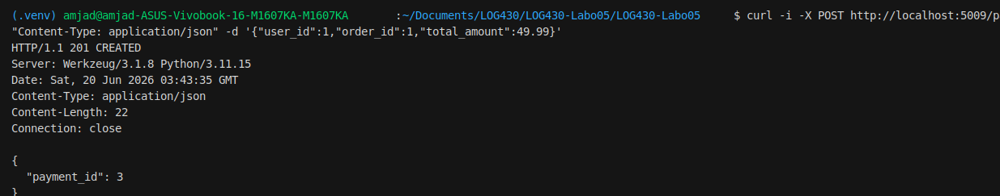

# Questions - Labo 05

## Question 1

Quelle réponse obtenons-nous à la requête à `POST /payments` ? Illustrez votre réponse avec des captures d'écran/du terminal.

### Réponse

La requête `POST /payments` crée une transaction de paiement dans le microservice de paiement. La réponse obtenue est un code HTTP `201 CREATED`, ce qui indique que la ressource a bien été créée. Le corps de la réponse contient l'identifiant du paiement créé, ici `payment_id: 3`.

Cet identifiant pourra ensuite être utilisé pour traiter le paiement avec l'endpoint `POST /payments/process/{payment_id}`.

### Illustration



Sortie terminal :

```bash
curl -i -X POST http://localhost:5009/payments \
  -H "Content-Type: application/json" \
  -d '{"user_id":1,"order_id":1,"total_amount":49.99}'
```

Réponse obtenue :

```http
HTTP/1.1 201 CREATED
Server: Werkzeug/3.1.8 Python/3.11.15
Date: Sat, 20 Jun 2026 03:43:35 GMT
Content-Type: application/json
Content-Length: 22
Connection: close

{
  "payment_id": 3
}
```

---

## Question 2

Quel type d'information envoyons-nous dans la requête à `POST payments/process/:id` ? Est-ce que ce serait le même format si on communiquait avec un service SOA, par exemple ? Illustrez votre réponse avec des exemples et captures d'écran/terminal.

### Réponse

À compléter.

### Illustration

Ajouter une capture d'écran ou une sortie terminal.

---

## Question 3

Quel résultat obtenons-nous de la requête à `POST payments/process/:id` ?

### Réponse

À compléter.

### Illustration

Ajouter une capture d'écran ou une sortie terminal.

---

## Question 4

Quelle méthode avez-vous dû modifier dans `log430-labo05-payment` et qu'avez-vous modifiée ? Justifiez avec un extrait de code.

### Réponse

À compléter.

### Extrait de code

```python
# Ajouter l'extrait de code modifié ici.
```

---

## Question 5

À partir de combien de requêtes par minute observez-vous les erreurs 503 ? Justifiez avec des captures d'écran de Locust.

### Réponse

À compléter.

### Illustration

Ajouter une capture d'écran de Locust.

---

## Question 6

Que se passe-t-il dans le navigateur quand vous faites une requête avec un délai supérieur au timeout configuré (5 secondes) ? Quelle est l'importance du timeout dans une architecture de microservices ? Justifiez votre réponse avec des exemples pratiques.

### Réponse

À compléter.

### Illustration

Ajouter une capture d'écran ou une sortie terminal.
